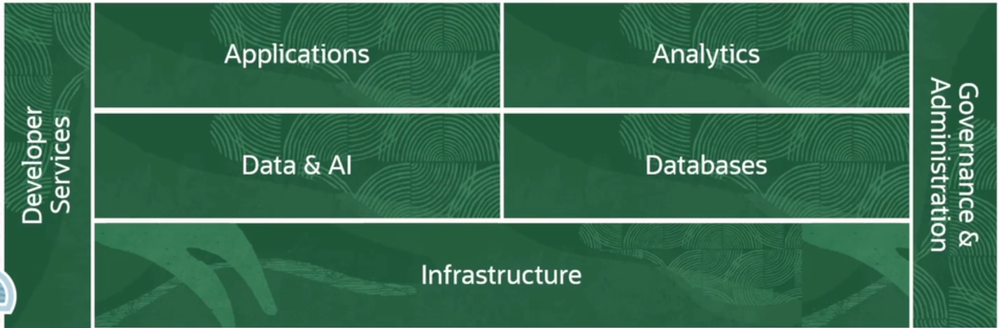
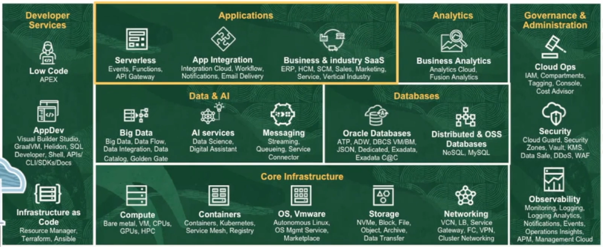
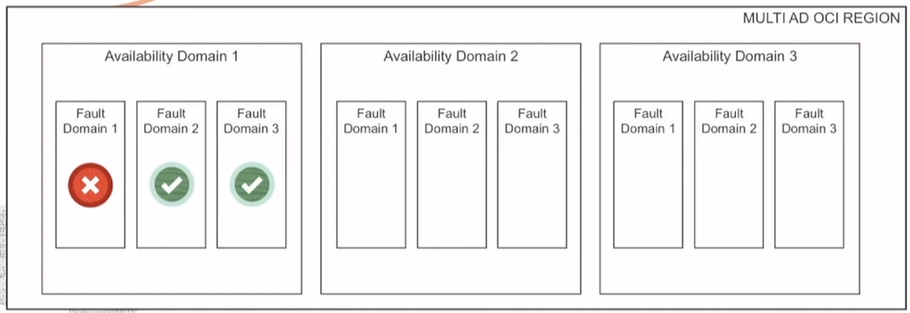
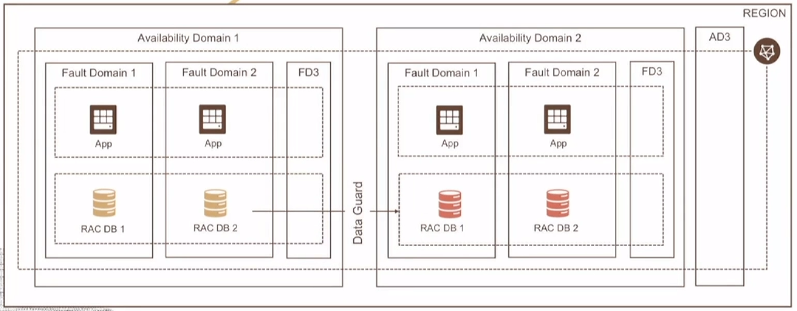
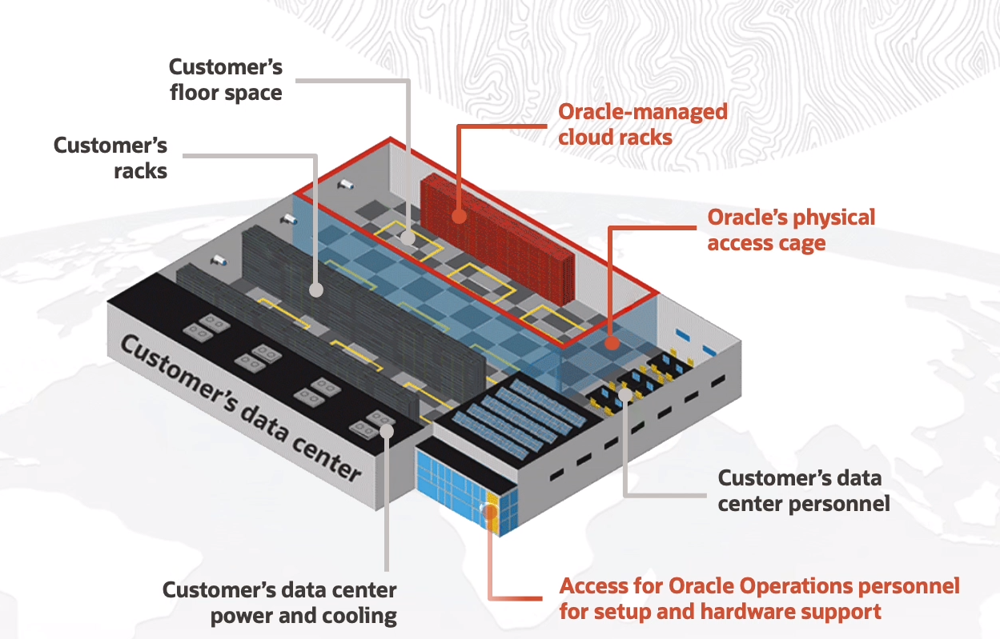
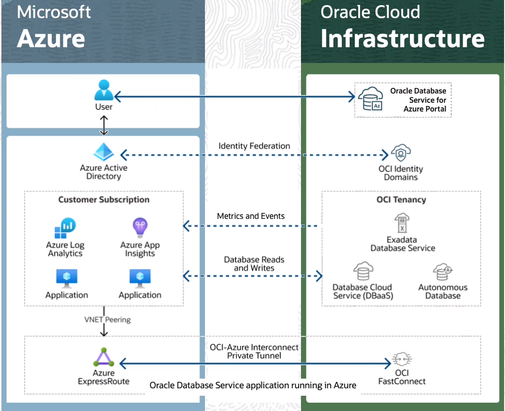
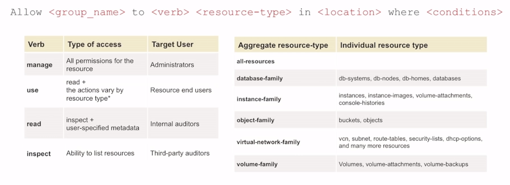
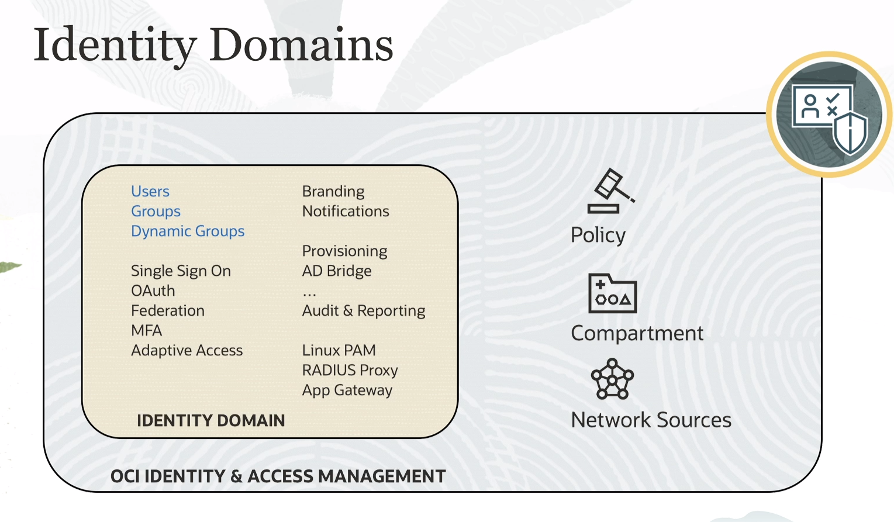
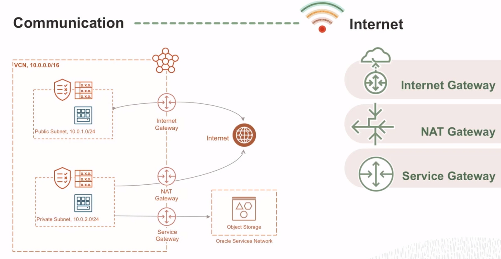
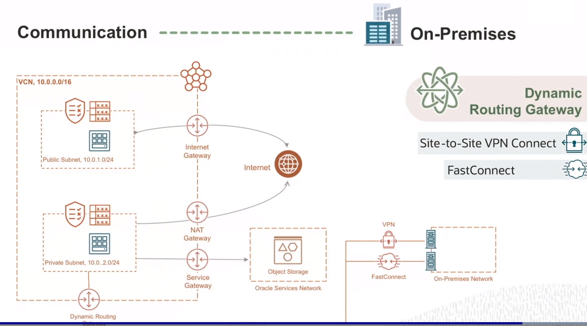

### Overview

----------------

### OCI Architecture

**Regiões**: área geográfica localizada composta de um ou mais domínios de disponibilidade.

**Domínios de disponibilidade**: Um ou mais data centers tolerantes a falhas localizados em uma região, mas conectados uns aos outros por uma rede.

**Domínios de falha**: Agrupamento de hardware e infraestrtura dentro de um domínio de disponibilidade para fornecer antiafinidade.

> Oracle cloud possui parceria multicloud com o Microsoft Azure.

> **Como escolher uma região?** 
> - Localização: Escolher uma mais próxima de seus usuários para obter latÊncia mais baixa e desempenho mais alto.
> - "Data residency & Compliance", muitos lugares tem leis sobre residência de dados
> - Disponibilidade de serviços: novas clouds são disponibilizadas conforme a demanda do local e outros fatores.

Para garantir que seus serviços nuna estejam indisponíveis, faça cópias idênticas entre domínios de falhas e em domínios de disponibilidade, não esquecendo de manter os dados sincronizado.

-----------

### OCI - Distributed Cloud

Serviço Cloud é distribuído, significa que clientes podem obter de muitas formas, pois oferece flexibilidade e escolha excepcionais

- Public Cloud
- Hybrid Cloud
- Dedicated Cloud
- Multicloud  

**Hybrid Cloud Services**

- Dedicated Region Cloud@Customer: regiões isoladas privadas com circulação de ar;

- Oracle Cloud VMware Solution: ambiente baseado em VMware na OCI o qual você pode migras VMs locais para nuvem de forma integrada;
- Autonomous DB on Exadata Cloud@Customer: todos os recusros avançados do Autonomous Db estão disponíveis em seu próprio ambiente local;
- Roving Edge Infrastructure: servidor denso, portátil, otimizado para computação e armazenamento, robusto para operar ambientes remotos e austeros.

**Multicloud : Microsoft Azure**

--------

### Demo: OCI Console Walk-through

**Demonstração da plataforma

-------

### Identify and Access Management

- Também reconhecido como controle de acesso refinado ou serviço de controle de acesso baseado em atribuição 

> AuthN - identidade ou quem é alguém  
> AuthZ - permissão de alguém ou o que tem permissão

**Domínios de identidade**

**Compartimentos**

Ao abrir uma conta no OCI, você obtém uma tenancy (conta) e é fornecido um compartimento raiz, ou seja, uma construção lógica que você pode manter todos os seus recursos de nuvem.
- Containers lógicos
- Você cria compartimentos para isolamento de recursos e controle de acesso
- Dentro deles é possível criar sinalizadores, seja de orçamento ou metas.

**VCN Introduction**

> Virtual Cloud Network: rede privada definida por softare criada no Oracle Cloud e usado para comunicação segura

- Possui espaço de endereço

**VCN Routing**